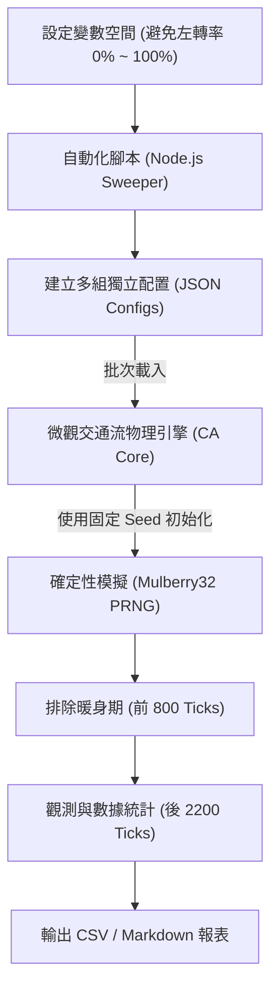

# 交通微觀模擬研究方法論 (Traffic Micro-Simulation Methodology)

本研究採用基於**胞元自動機（Cellular Automata, CA）**與**動態帶權 Dijkstra 最短路徑演算法**的微觀交通流模擬系統，透過 Headless 自動化腳本進行批量參數掃描（Parameter Sweep）實驗。

---

## 1. 實驗架構與批量執行機制 (Headless Batch Execution)

本模擬的批量實驗運作邏輯如下圖所示：

您的理解完全正確！實驗的執行機制是：**「給定多組不同的 JSON 配置檔，依序餵入同一個確定的模擬演算法引擎中執行，並輸出標準化的指標進行對比。」**

### 確定性控制 (Deterministic Calibration)
為了保證 A/B 測試與多參數掃描的科學可信度，系統排除了一切隨機干擾：
*   使用特定的種子（`Seed: 42`）搭配 `Mulberry32` 虛擬隨機數生成器（PRNG）。
*   在相同的密度與種子下，**路網的幾何形狀（路段長度）與車輛的注入順序、目的地分配是完全一致的**。
*   **唯一改變的自變數**是車輛的屬性配置（如駕駛避開左轉的機率），藉此分離出單一變數對系統造成的淨影響。

---

## 2. 微觀行為建模與演算法引擎 (Core Algorithms)

模擬引擎主要由兩個底層演算法驅動：

### ① 微觀物理運動模型：Nagel-Schreckenberg (NaSch) 胞元自動機
每輛車在每個時間步（Tick）遵循以下四步物理規則更新位置與速度：
1.  **加速**：若未達限速，速度加 1 單位：$v_i \rightarrow \min(v_i + 1, V_{max})$。
2.  **避撞減速**：確保不撞上前車：$v_i \rightarrow \min(v_i, gap)$（$gap$ 為前車淨距）。
3.  **隨機慢化**：以機率 $p_{slow}$ 減速 1 單位，模擬人類不確定性。
4.  **位置更新**：向前移動：$x_i \rightarrow x_i + v_i$。

### ② 路徑規劃與分流決策：轉向權重感知 Dijkstra 演算法
本研究將路網抽象化為狀態圖。為了模擬駕駛「避開左轉」的行為，系統將傳統的無權重 BFS 演算法升級為 **Dijkstra 最短路徑演算法**。
*   將交叉口與行駛方向編碼為狀態節點：$(Node, Heading)$。
*   **轉向權重公式**：
    $$Cost(u \rightarrow w) = LinkLength + TurnPenalty$$
    其中，`TurnPenalty` 依轉向類型動態決定：
    *   **直行**：$0$
    *   **右轉**：$0.2$ (模擬右轉微幅減速)
    *   **左轉**：若車輛決策為「避開左轉」（`avoidLeft = true`），則左轉懲罰設為 **$10.0$**（迫使演算法尋找連續三次右轉的繞道）；若為「直接左轉」，則懲罰為 **$0.0$**。

---

## 3. 實驗流程與指標定義

### 排除暖身期 (Warm-up Phase)
微觀模擬開始時，路網內是無車的。若直接統計，會因前期的「空網加載階段」拉低平均旅行時間。本研究設定：
*   **總模擬長度**：10000 Ticks
*   **暖身期（Warm-up Ticks）**：前 2000 Ticks
*   **觀測視窗（Observation Window）**：後 8000 Ticks，當車流密度達到穩定動態平衡（Steady State）後，才開始採集指標。

### 觀測指標 (Metrics)
1.  **平均旅行時間 (Mean Travel Time)**：車輛從生成（Spawn）到抵達目的地（Exit）所需的平均 Ticks 數。
2.  **系統吞吐量 (Throughput)**：平均每 Tick 完成通過路口的車輛數（輛/tick）。
3.  **完成率 (Completion Rate)**：在觀測時間內順利通關的車輛佔總生成車輛的比例。
