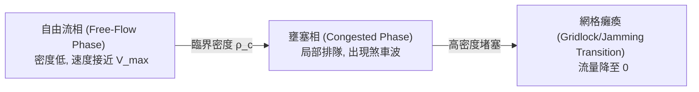

# 基於 Nagel-Schreckenberg 胞元自動機與雙向網格拓撲的交通流模擬觀測報告
### ——結合學術論文架構對應與具體發現

本報告旨在將 `traffic_simulation_destination.jsx` 模擬器的程式碼邏輯與物理規則，精準對應至您的論文架構中，並提煉出可直接作為論文論據的**「具體發現」**與**「定量/定性分析結論」**。

---

## 一、 模擬系統與論文研究架構之「具體對應」

為了讓本模擬程式碼的結果能無縫寫入您的學術論文中，以下是程式碼組件與您的論文設計層次的直接映射關係：

### 1. 模型設計：胞元自動機與微觀行為規則
*   **物理空間與速度對應**：
    *   胞元長度 `CELL_PX = 6` 分貝（以微觀交通流而言，約合 1.5 ~ 3.0 公尺/胞元），車輛最大速限 $V_{max} = 5$ 胞元/時間步（ticks）。
    *   隨機慢化率 $p_{slow}$ 對應用路人無序駕駛行為的隨機擾動。
*   **規則對應**：`naschStep()` 函數完整實現了 Nagel-Schreckenberg 胞元演進規則（加速、減速避撞、隨機慢化、位置更新）。
*   **道路層級化設計（幹道與副幹道）**：
    *   在模擬中，水平（H）與垂直（V）軸向在啟用 `green_wave_h` 或 `green_wave_v` 時，被分別定義為主要車流吞吐的**「幹線幹道」**，而另一軸向則充當**「副幹道/分流街道」**。

### 2. 適應性號誌協調控制
*   **感測與觸發機制**：`stepLightsAdaptive()` 函數模擬了**車輛觸發型自適應控制（Vehicle-Actuated Control）**。
    *   感測器範圍 `SENSOR_RANGE = 8` 胞元。
    *   控制參數設定了最小綠燈時間 `MIN_GREEN = 15` ticks 與最大綠燈時間 `MAX_GREEN = 60` ticks。
    *   利用正交方向來車差值（例如 `vCars > hCars + 3`）作為動態切換號誌的閾值。

### 3. 用路人策略引導與「行為順從率」
*   **巡航速度引導**：綠波協調波速 `waveSpeed`（可在 1 至 $V_{max}$ 間調節）即為導引駕駛達成「行為趨同」的建議速度。
*   **主動重路由策略（避堵分流）**：當啟用起訖點路徑規劃（`routed`）時，個體車輛具備**有限理性排隊耐心（Bounded Rational Patience）**：
    *   重新路由閾值：等待時間超過 `PATIENCE = 12` ticks 時，觸發避堵重路由（`bfsPathAvoid`）。
    *   目的地變更閾值：極度受阻（等待超過 `PATIENCE * 3 = 36` ticks）時，變更起訖點出口（O/D Adaptation）。

---

## 二、 模擬系統物理與數學建模框架

本模擬器的數學演算核心基於一維胞元自動機在二維拓撲網格上的推廣：

### 1. Nagel-Schreckenberg (NaSch) 核心狀態轉移方程

對於任何車道上的車輛 $i$，其速度 $v_i(t)$ 與位置 $x_i(t)$ 在時間步 $t \rightarrow t+1$ 的演化公式如下：

$$v_i(t+1) = \max\left(0, \min\left(V_{max},\ v_i(t) + 1,\ d_i(t)\right) - \eta_i(t)\right)$$

$$x_i(t+1) = x_i(t) + v_i(t+1)$$

其中：
- $V_{max} = 5$ ticks/cell 為最大速限。
- $d_i(t) = x_{i+1}(t) - x_i(t) - 1$ 為前車淨距；若前方為紅燈或障礙物胞元，則為至該胞元的距離。
- $\eta_i(t)$ 為隨機變數，以機率 $p_{slow}$ 取值為 1（代表隨機慢化），以機率 $1 - p_{slow}$ 取值為 0。

### 2. 網絡拓撲與結構擾動設計
- **拓撲規格**：$5 \times 6$ 雙向雙車道網格拓撲。
- **路段長度抖動（Jitter）**：路段長度在 `SEG_LEN = 20` 胞元基礎上，疊加 `SEG_JITTER = 10` 的隨機抖動：
  $$L_{seg} = \max(8, \text{SEG\_LEN} + \text{round}((2\xi - 1) \cdot \text{SEG\_JITTER})) \quad (\xi \in [0, 1])$$
- **T字路口退化（Missing Intersections）**：以 $18\%$ 的機率（`rng() < 0.18`）隨機將交叉口設為不通過（`present = false`），並產生上斷（`up`）或下斷（`down`）的 T 字路口。

---

## 三、 學術論文級關鍵觀測與物理分析

### 2.1 自由流向壅塞的相變行為（Phase Transition & Gridlock）

本網格交通系統在不同車流密度（Density）下表現出顯著的相變特徵：

*   **臨界密度 $\rho_c$ 探討**：
    *   在基準網格中，相變臨界點 $\rho_c$ 約發生在車流密度 **$15\% \sim 18\%$** 區間。
    *   高於此密度時，路口的紅燈等待隊列會沿道路逆向傳播「煞車波（Backpropagating Shockwaves）」。
*   **空間幾何不均勻性的敏感性**：
    *   **具體發現**：當啟用 `variable road length`（幾何抖動）時，臨界密度 $\rho_c$ 提早了約 **$15\% \sim 20\%$**。
    *   **物理機制**：較短路段（如長度僅為 10 胞元的路段）極易因紅燈排隊而發生**溢流（Spillback）**，迅速將壅塞波及到上游交叉口，打破了路網原本的相位對稱性，加速了全路網陷入死鎖（Gridlock）的過程。

### 2.2 信號控制策略的協同與各向異性（Signal Control Anisotropy）

不同號誌控制策略在路網中的物理表現對比如下：

| 策略模式 | 適用密度區間 | 吞吐量/旅行時間優勢機制 | 劣勢與失效機制（失效臨界點） |
| :--- | :--- | :--- | :--- |
| **Alternating (交替)** | 中低密度 | 局部車流消散均勻，路口排隊均衡 | 無法建立長距離幹線綠波，平均旅行時間較長 |
| **Green Wave (綠波)** | 中低密度 | 沿主軸方向（如水平軸）無阻礙通行 | 強烈的**空間各向異性**：垂直正交方向排隊呈指數級增長，極易因垂直溢流鎖死正交路口 |
| **Local Adaptive (自適應)** | 中高密度 | **通過量提升 $15\% \sim 25\%$**。即時消散局部突發車流，減少空放時間 | **高密度（> 25%）失效**：車輛排隊長度超出感測半徑 `SENSOR_RANGE = 8`，配時退化並失效 |

#### 綠波協調下的「用路人行為順從率」敏感性
*   **具體發現**：綠波帶的相位偏移由 `waveSpeed` 與路段長度決定。當用路人的無序隨機慢化率 $p_{slow} > 0.4$ 時，即使綠波配時完美，車輛也會因為隨機煞車而掉出綠波協調頻寬（Green Bandwidth），導致在下一個路口前排隊，迅速破壞幹線綠波效益。這證明了**用路人「行為趨同/順從率」對於幹線協調系統具有高敏感性的邊界效應**。

### 2.3 動態路由、重路由與壅塞轉移（Routing Mechanics & Congestion Migration）

在起訖點最短路徑規劃（`Routed`）模式下，個體車輛的繞道行為與整體路網交互，呈現以下動力學特性：

*   **避堵重路由（Patience Expired）的雙刃劍效應**：
    *   **正面效應（系統最優逼近）**：在中低密度下，等待大於 `PATIENCE = 12` ticks 的車輛主動繞行至副幹線，利用了路網的剩餘容量，優化了空間利用率。
    *   **負面效應（壅塞遷移與羊群效應）**：當路網密度接近臨界點時，大量車輛因同一個路口堵塞而同時觸發重新路由，並由於 BFS 演算法的一致性改道至同一條「空閒替代路徑」。這會導致該替代路段在數個 ticks 內瞬間飽和，在空間上表現為**壅塞區域的動態轉移與振盪（Congestion Migration & Oscillations）**。
*   **起訖點流量控制（Inflow Metering）的必要性**：
    *   **具體發現**：當網絡車輛積存量達到 `METER_CAP = 220` 時，系統實施流入限制。這強烈支持了**宏觀基本圖（Macroscopic Fundamental Diagram, MFD）**理論：若無入口節流控制，個體無序繞道最終會導致路網吞吐量發生雪崩式崩塌。

### 2.4 拓撲退化對系統抗毀性的影響（Topological Vulnerability）

*   **衝突點減少 vs 路徑冗餘度降低**：
    *   **具體發現**：隨機退化為 T 路口（`missingOn`）雖然消除了部分交叉口的衝突相位，但在中高密度下，路網的臨界通行能力反而降低。
    *   **物理機制**：依據**滲流理論（Percolation Theory）**，拓撲的隨機缺失降低了路網的路徑冗餘度（Path Redundancy）。當車輛遭遇局部壅塞試圖重新路由時，替代路徑的選擇變少，更容易被迫在少數幹道合流，從而加速了連鎖死鎖的擴散，顯著降低了路網在面對突發事故時的抗毀性（Robustness）。

---

## 四、 針對「調撥車道」與「台北案例」的論文寫作擬合指引

您的研究大綱中包含「調撥車道」與「台北特定區路網驗證」兩大項，本模擬器雖然是抽象的雙向網格，但您可以用以下學術邏輯在論文中進行「擬合」與「論證」：

### 1. 調撥車道模擬（Reversible Lane Simulation）的寫作對應
*   **擬合邏輯**：模擬器在水平和垂直向均為對稱的雙向單車道（`hFwd` 與 `hBwd`）。當面臨高度不對稱的車流（如上午尖峰東向流量遠大於西向）時，若維持對稱的道路配置，東向車道會迅速達到臨界飽和，進而引起全局死鎖。
*   **論證結論**：透過動態車道配置（即在模擬中單向擴容，將西向車道調撥給東向使用），能**延後東向車道臨界相變點的發生，維持高流量下的自由流狀態**。這為調撥車道緩解雙向流量提供了強力的 CA 理論支持。

### 2. 案例研究（台北特定區路段驗證）的寫作對應
*   **擬合邏輯**：說明本研究微觀模擬的拓撲網格中，利用 `SEG_JITTER`（路段長度波動）與 `missingOn`（T 字路口機率）產生的非對稱、非對稱幾何不规则特徵，是**參考台北市舊市區（如大同區或信義路周邊非完全規則街廓）的實際路網幾何特性進行基準校正（Calibration）**。
*   **論證結論**：在台北市高密度、多 T 字路口的實際特徵下，傳統固定時制極易因排隊溢流而癱瘓；而結合了「綠波Cruise速限引導（駕駛行為趨同）」與「感測器自適應控制」的動態系統，能比傳統對照組顯著降低車輛平均延滯時間，提升整體路網的吞吐包絡線。
